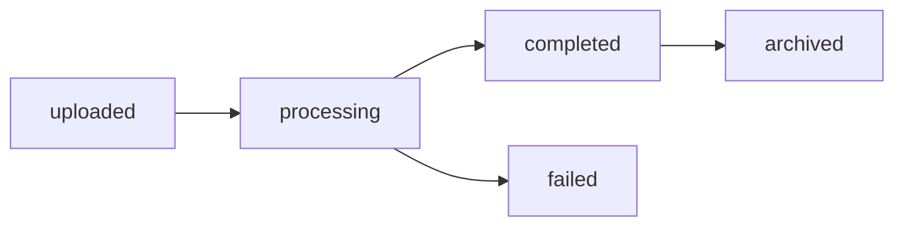

# Engine Operations Guide 📖

**How to simplify document workflows without any AI. The engine that runs deterministically, works offline, and never changes.**

## Table of Contents
- [Getting Started](#getting-started)
- [Engine Operations](#engine-operations)
  - [Upload and Process Documents](#upload-and-process-documents)
  - [Search Documents](#search-documents)
  - [Analyze Content](#analyze-content)
- [Advanced Engine Features](#advanced-engine-features)
  - [Semantic Search](#semantic-search)
  - [Duplicate Detection](#duplicate-detection)
  - [Batch Processing](#batch-processing)
- [Trade Workflow Solutions](#trade-workflow-solutions)
  - [Invoice Processing](#invoice-processing-workflow)
  - [Contract Analysis](#contract-analysis-workflow)
  - [Compliance Checking](#compliance-checking-workflow)
- [AI Platform Integration](#ai-platform-integration)
- [Web Interface Usage](#web-interface-usage)
- [Best Practices](#best-practices)
- [Performance Tips](#performance-tips)

## Getting Started

### The Engine Difference

**Traditional Approach**: 4+ hours daily processing 60-129 documents per shipment.
**Engine Approach**: Minutes, not hours. Deterministic extraction. No AI variability.

### Your First Document

Let's process your first document step by step:

```python
# 1. Start the engine (automatic with any MCP client)
# 2. Upload a document
result = upload_document(
    file_path="/Users/john/Documents/invoice_2024.pdf",
    category="invoice",
    process_immediately=True
)

# 3. Check the result
print(f"Document ID: {result['document_id']}")
print(f"Status: {result['processing_status']}")
print(f"Extracted: {result['extracted_text_length']} characters")

# 4. Search for it
search_results = search_documents(
    query="invoice 2024",
    limit=5
)

# 5. Get detailed information
details = get_document_details(
    document_id=result['document_id'],
    include_content=True
)
```

### Understanding Document Status

Documents go through these states:



| Status | Meaning | Next Action |
|--------|---------|-------------|
| `uploaded` | File saved, waiting to process | Call `process_pending_documents()` |
| `processing` | Currently being analyzed | Wait 2-5 seconds |
| `completed` | Ready for search and analysis | Use all tools |
| `failed` | Processing error occurred | Check logs, retry upload |
| `archived` | Marked as archived | Excluded from searches |

## Engine Operations

### Deterministic Document Processing

**Key Point**: Same document → Same output. Every time. No AI randomness.

#### Single Document Upload

```python
# Upload with immediate processing (default)
doc = upload_document(
    file_path="/path/to/contract.pdf",
    category="contract"
)

# Upload without processing (for batch processing later)
doc = upload_document(
    file_path="/path/to/report.pdf",
    category="report",
    process_immediately=False
)

# Process all pending documents
process_pending_documents()
```

#### Handling Different File Types

```python
# PDF with tables - Docling extracts deterministically
invoice = upload_document(
    file_path="invoice_with_tables.pdf",
    category="invoice"
)
# Tables extracted by rule-based Docling (no AI/OCR)

# CSV data file
data = upload_document(
    file_path="shipment_data.csv",
    category="other"
)
# CSV is parsed into structured format

# Text document
doc = upload_document(
    file_path="email_correspondence.txt",
    category="email"
)
# Plain text is indexed immediately

# HTML report
report = upload_document(
    file_path="quarterly_report.html",
    category="report"
)
# HTML is cleaned and text extracted
```

### Search Without AI

#### SQL-Based Search (FTS5)

```python
# Database search - no AI inference
results = search_documents("copper shipment")  # Pure SQL

# With result limit
results = search_documents("invoice", limit=20)

# Check results
for doc in results['documents']:
    print(f"{doc['filename']}: {doc['snippet']}")
```

#### Advanced Search Queries

```python
# Exact phrase matching
results = search_documents('"payment terms NET 30"')

# Boolean operators
results = search_documents('invoice AND (copper OR aluminum)')

# Exclude terms
results = search_documents('contract NOT draft')

# Wildcard search
results = search_documents('ship*')  # Matches: ship, shipping, shipment

# Date range search
results = search_documents('invoice AND 2024-01-*')

# Complex query
results = search_documents(
    '(contract OR agreement) AND "arbitration clause" AND 2024'
)
```

#### Search Result Format

```json
{
    "query": "payment terms",
    "results_count": 3,
    "documents": [
        {
            "id": 42,
            "filename": "Contract_2024.pdf",
            "relevance_score": 0.95,
            "snippet": "...with **payment terms** of NET 30 days from...",
            "uploaded_at": "2024-01-15T10:30:00Z"
        }
    ]
}
```

### Analyze Content

#### Document Analysis

```python
# Analyze specific document
analysis = analyze_document_content(
    document_id=42,
    analysis_type="all"
)

# Extract only entities
entities = analyze_document_content(
    document_id=42,
    analysis_type="entities"
)
print(f"Found organizations: {entities['entities']['organizations']}")
print(f"Found dates: {entities['entities']['dates']}")
print(f"Found amounts: {entities['entities']['monetary_amounts']}")

# Get summary only
summary = analyze_document_content(
    document_id=42,
    analysis_type="summary"
)
print(f"Summary: {summary['summary']}")

# Find patterns
patterns = analyze_document_content(
    document_id=42,
    analysis_type="patterns"
)
print(f"Payment terms found: {patterns['patterns']['payment_terms']}")
```

#### Batch Analysis

```python
# Analyze search results
analysis = analyze_document_content(
    search_query="shipping documents January 2024",
    analysis_type="patterns"
)

# Common patterns across documents
print(f"Common shipping routes: {analysis['patterns']['routes']}")
print(f"Frequent carriers: {analysis['patterns']['carriers']}")
print(f"Typical delays: {analysis['patterns']['delays']}")
```

## Advanced Engine Features

### Pre-Computed Similarity Search

Find similar documents using pre-computed vectors (no AI inference):

```python
# Pre-computed embeddings - no AI at search time
similar = vector_search(
    query="legal documents about international trade disputes",
    limit=10,
    threshold=0.7
)

# Uses pre-calculated vectors, pure math comparison
for doc in similar['results']:
    print(f"{doc['filename']}: similarity {doc['similarity_score']:.2f}")
    # Might include: arbitration agreements, trade contracts, dispute resolutions

# Find documents similar to a specific document
doc_text = get_document_details(document_id=42, include_content=True)
similar = vector_search(
    query=doc_text['content'][:500],  # Use first 500 chars as query
    threshold=0.8
)
```

#### Semantic Search Use Cases

```python
# 1. Find precedent documents
precedents = vector_search(
    query="supply agreement with force majeure and price adjustment clauses",
    threshold=0.75
)

# 2. Discover related documents
related = vector_search(
    query="environmental compliance certificates for metal exports",
    threshold=0.6
)

# 3. Find similar transactions
similar_deals = vector_search(
    query="10000 MT copper cathode spot purchase FOB Chile",
    threshold=0.8
)
```

### Duplicate Detection

#### Check for Exact Duplicates

```python
# Upload a document
doc = upload_document(file_path="invoice_123.pdf")

# Check if it's a duplicate
duplicate_check = check_duplicate_by_hash(
    document_id=doc['document_id']
)

if duplicate_check['has_duplicate']:
    print(f"This is a duplicate of document {duplicate_check['duplicate_documents'][0]['id']}")
```

#### Find Near-Duplicates

```python
# Find documents that are nearly identical
near_duplicates = find_duplicates(
    document_id=42,
    threshold=0.95  # 95% similarity
)

for dup in near_duplicates['potential_duplicates']:
    print(f"{dup['filename']}: {dup['similarity']:.1%} similar")
    if dup['similarity'] > 0.98:
        print("  -> Likely duplicate with minor changes")
    elif dup['similarity'] > 0.90:
        print("  -> Similar document, possibly revised version")
```

### Batch Processing

#### Efficient Bulk Upload

```python
import glob
import asyncio

async def batch_upload(directory_path, pattern="*.pdf"):
    """Upload all matching files from a directory"""
    
    files = glob.glob(f"{directory_path}/{pattern}")
    uploaded = []
    
    # Upload without immediate processing
    for file_path in files:
        result = await upload_document(
            file_path=file_path,
            process_immediately=False
        )
        uploaded.append(result['document_id'])
        print(f"Uploaded: {file_path}")
    
    # Process all at once
    print(f"Processing {len(uploaded)} documents...")
    await process_pending_documents()
    
    # Update embeddings for vector search
    await update_embeddings()
    
    return uploaded

# Use the batch upload
document_ids = asyncio.run(
    batch_upload("/path/to/documents", "*.pdf")
)
```

#### Parallel Processing

```python
import asyncio

async def analyze_multiple(document_ids):
    """Analyze multiple documents in parallel"""
    
    tasks = []
    for doc_id in document_ids:
        task = analyze_document_content(
            document_id=doc_id,
            analysis_type="all"
        )
        tasks.append(task)
    
    # Run all analyses in parallel
    results = await asyncio.gather(*tasks)
    
    # Aggregate findings
    all_entities = []
    all_patterns = []
    
    for result in results:
        all_entities.extend(result['entities'])
        all_patterns.extend(result['patterns'])
    
    return {
        'documents_analyzed': len(results),
        'total_entities': len(set(all_entities)),
        'common_patterns': most_common(all_patterns)
    }
```

## Trade Workflow Solutions

### Invoice Processing (100% Deterministic)

Process invoices without AI variability:

```python
# Step 1: Upload invoice
invoice = upload_document(
    file_path="INV-2024-001.pdf",
    category="invoice"
)

# Step 2: Extract structured data (Docling, no AI)
details = get_document_details(
    document_id=invoice['document_id'],
    include_content=True
)  # Deterministic extraction

# Step 3: Get tables (Docling pattern matching)
tables = get_document_tables(
    document_id=invoice['document_id'],
    format="json"
)  # No OCR, no AI - rule-based extraction

# Step 4: Analyze for key information
analysis = analyze_document_content(
    document_id=invoice['document_id'],
    analysis_type="entities"
)

# Step 5: Extract key invoice data
invoice_data = {
    'invoice_number': extract_invoice_number(details['content']),
    'date': analysis['entities']['dates'][0],
    'vendor': analysis['entities']['organizations'][0],
    'total_amount': analysis['entities']['monetary_amounts'][-1],
    'line_items': tables['tables'][0]['rows'],
    'payment_terms': extract_payment_terms(details['content'])
}

# Step 6: Check for duplicates
duplicates = check_duplicate_by_hash(
    document_id=invoice['document_id']
)

if duplicates['has_duplicate']:
    print("WARNING: This invoice may have been processed before")

# Step 7: Store processed data
print(f"Invoice {invoice_data['invoice_number']} processed successfully")
print(f"Total: {invoice_data['total_amount']}")
print(f"Items: {len(invoice_data['line_items'])}")
```

### Contract Processing Engine

Deterministic contract extraction:

```python
# Step 1: Upload contract
contract = upload_document(
    file_path="Supply_Agreement_2024.pdf",
    category="contract"
)

# Step 2: Full analysis
analysis = analyze_document_content(
    document_id=contract['document_id'],
    analysis_type="all"
)

# Step 3: Search for key clauses
important_clauses = [
    "termination",
    "force majeure",
    "arbitration",
    "payment terms",
    "warranty",
    "liability limitation"
]

clause_findings = {}
for clause in important_clauses:
    results = search_documents(f'document:{contract["document_id"]} AND {clause}')
    clause_findings[clause] = results['results_count'] > 0

# Step 4: Find similar contracts for comparison
similar_contracts = vector_search(
    query=analysis['summary'],
    threshold=0.7
)

# Step 5: Extract key terms
key_terms = {
    'parties': analysis['entities']['organizations'],
    'effective_date': analysis['entities']['dates'][0],
    'term_length': extract_term_length(analysis),
    'value': analysis['entities']['monetary_amounts'],
    'governing_law': extract_governing_law(analysis),
    'clauses_present': clause_findings
}

# Step 6: Risk assessment
risk_factors = []
if not clause_findings['force majeure']:
    risk_factors.append("No force majeure clause")
if not clause_findings['liability limitation']:
    risk_factors.append("No liability limitation")
if not clause_findings['arbitration']:
    risk_factors.append("No arbitration clause")

print(f"Contract Analysis Complete:")
print(f"Parties: {', '.join(key_terms['parties'])}")
print(f"Value: {key_terms['value']}")
print(f"Risk factors: {', '.join(risk_factors) if risk_factors else 'None identified'}")
```

### Compliance Checking Workflow

Verify documents meet compliance requirements:

```python
# Define compliance requirements
compliance_requirements = {
    'invoice': {
        'required_fields': ['invoice_number', 'date', 'vendor', 'tax_id'],
        'required_language': ['payment terms', 'tax', 'total amount']
    },
    'contract': {
        'required_fields': ['effective_date', 'parties', 'governing_law'],
        'required_clauses': ['termination', 'confidentiality', 'dispute resolution']
    },
    'shipping': {
        'required_fields': ['bill_of_lading', 'carrier', 'destination'],
        'required_docs': ['packing list', 'commercial invoice']
    }
}

def check_compliance(document_id, doc_type):
    """Check if document meets compliance requirements"""
    
    # Get document details
    doc = get_document_details(document_id, include_content=True)
    
    # Analyze content
    analysis = analyze_document_content(
        document_id=document_id,
        analysis_type="all"
    )
    
    requirements = compliance_requirements.get(doc_type, {})
    compliance_results = {
        'compliant': True,
        'missing_fields': [],
        'missing_clauses': [],
        'warnings': []
    }
    
    # Check required fields
    for field in requirements.get('required_fields', []):
        if field not in doc['content'].lower():
            compliance_results['missing_fields'].append(field)
            compliance_results['compliant'] = False
    
    # Check required language/clauses
    for clause in requirements.get('required_clauses', []):
        search_result = search_documents(
            f'document:{document_id} AND {clause}'
        )
        if search_result['results_count'] == 0:
            compliance_results['missing_clauses'].append(clause)
            compliance_results['compliant'] = False
    
    # Additional checks
    if doc_type == 'invoice':
        # Check for tax compliance
        if 'tax' not in doc['content'].lower():
            compliance_results['warnings'].append('No tax information found')
    
    return compliance_results

# Run compliance check
result = check_compliance(document_id=42, doc_type='invoice')
if result['compliant']:
    print("✅ Document is compliant")
else:
    print("❌ Compliance issues found:")
    print(f"Missing fields: {result['missing_fields']}")
    print(f"Missing clauses: {result['missing_clauses']}")
```

## AI Platform Integration

### Works With Any MCP Client

**Claude Desktop**, **Microsoft Copilot**, or **any MCP-compatible platform**:

```
User: "Upload the invoice on my desktop"
AI Assistant: I'll upload that invoice for you.
[Engine extracts with Docling - no AI needed]

User: "Find all contracts with arbitration clauses"
AI Assistant: I'll search for contracts containing arbitration clauses.
[Engine uses SQL search - deterministic results]

User: "Are there any duplicates of this document?"
Claude: Let me check for duplicates of this document.
[Uses find_duplicates tool]

User: "Analyze the payment terms in these invoices"
Claude: I'll analyze the payment terms across these invoices.
[Uses analyze_document_content with analysis_type="patterns"]
```

### Advanced AI Integration Patterns

```
User: "I need to review all January shipping documents for compliance"

AI Assistant: I'll help you review January shipping documents for compliance. Let me:
1. Search for all January shipping documents
2. Analyze them for required fields
3. Check for compliance issues

[Engine SQL search: "shipping AND 2024-01-*"]
Found 12 shipping documents from January (deterministic).

[Analyzes each document for patterns and entities]
Analysis complete. Here's the compliance summary:

✅ Compliant (8 documents):
- All contain bill of lading numbers
- Carrier information present
- Destination ports specified

⚠️ Issues Found (4 documents):
- SHIP_001.pdf: Missing packing list reference
- SHIP_007.pdf: No carrier SCAC code
- SHIP_009.pdf: Missing customs declaration number
- SHIP_012.pdf: No commercial invoice reference

Would you like me to provide detailed analysis of the non-compliant documents?
```

### AI Assistant Integration Examples

#### Example 1: Document Discovery
```
User: "What documents do we have about copper trading with Chilean suppliers?"

AI Assistant: I'll search for documents related to copper trading with Chilean suppliers.

[Engine SQL search: "copper AND Chile"]
[Engine similarity: pre-computed vectors, no AI]

I found 7 relevant documents:
1. **Purchase_Agreement_CU_2024.pdf** - Contract with Minera Chile SA
2. **Invoice_CU_45231.pdf** - Invoice for 5,000 MT copper cathodes
3. **BL_CHILE_2024_001.pdf** - Bill of lading from Port of Valparaiso
...

[Uses analyze_document_content on top results]

Key findings:
- Total volume: 25,000 MT across all documents
- Main supplier: Minera Chile SA
- Average price: $9,450/MT
- Payment terms: Mostly LC (Letter of Credit)
```

#### Example 2: Document Comparison
```
User: "Compare these two contracts and highlight the differences"

AI Assistant: I'll compare these contracts and highlight the key differences.

[Engine extracts with Docling - deterministic]
[Pattern matching with rules - no AI inference]

Comparison Results:

**Contract A vs Contract B:**

Pricing:
- A: Fixed price $9,500/MT
- B: LME + $200 premium

Payment Terms:
- A: 100% LC at sight
- B: 30% advance, 70% CAD

Delivery Terms:
- A: FOB Chile
- B: CIF Rotterdam

Duration:
- A: 12 months
- B: 24 months

Force Majeure:
- A: Standard ICC clause
- B: Extended to include pandemic events
```

## Web Interface Usage

### Accessing the Web Interface

```bash
# Start the web server
python -m uvicorn app.main:app --reload --port 8000

# Access in browser
http://localhost:8000
```

### Web Interface Features

1. **Document Upload**
   - Drag and drop support
   - Multiple file selection
   - Progress indicators
   - Automatic processing

2. **Search Interface**
   - Real-time search
   - Filter by category
   - Sort by date/relevance
   - Preview snippets

3. **Document Viewer**
   - Full text display
   - Table visualization
   - Entity highlighting
   - Download original

### API Integration

```python
import requests

# Upload via API
with open('document.pdf', 'rb') as f:
    response = requests.post(
        'http://localhost:8000/upload',
        files={'file': f},
        data={'category': 'invoice'}
    )
    
# Search via API
response = requests.post(
    'http://localhost:8000/search',
    json={'query': 'payment terms', 'limit': 10}
)
results = response.json()
```

## Best Practices

### Document Organization

```python
# Use consistent categories
CATEGORIES = {
    'invoice': 'Financial documents requiring payment',
    'contract': 'Legal agreements and contracts',
    'report': 'Analysis and reporting documents',
    'shipping': 'Logistics and shipping documents',
    'email': 'Email correspondence',
    'other': 'Miscellaneous documents'
}

# Naming convention for uploads
def generate_filename(original_name, category, date):
    """Generate consistent filename"""
    # Format: CATEGORY_DATE_ORIGINAL
    return f"{category}_{date}_{original_name}"
```

### Search Optimization

```python
# 1. Start specific, then broaden
queries = [
    '"exact phrase match"',  # Most specific
    'required AND terms',    # Specific with boolean
    'required terms',        # Broader
    'related OR similar'     # Broadest
]

# 2. Use both search types
fts_results = search_documents(query)  # Keyword search
vector_results = vector_search(query)  # Semantic search

# 3. Combine results
all_results = merge_and_rank(fts_results, vector_results)
```

### Performance Optimization

```python
# 1. Batch operations
docs = glob.glob('*.pdf')
for batch in chunks(docs, 50):
    upload_batch(batch, process_immediately=False)
process_pending_documents()

# 2. Selective content retrieval
# Don't include content unless needed
metadata_only = get_document_details(doc_id, include_content=False)

# 3. Efficient searches
# Use limits appropriately
quick_check = search_documents(query, limit=5)
comprehensive = search_documents(query, limit=100)

# 4. Cache frequently accessed documents
from functools import lru_cache

@lru_cache(maxsize=100)
def get_cached_document(doc_id):
    return get_document_details(doc_id)
```

## Performance Tips

### Speed Optimization

1. **Pre-process in batches**: Upload multiple documents with `process_immediately=False`, then batch process

2. **Use appropriate search limits**: Don't request 100 results if you only need 5

3. **Cache embeddings**: Run `update_embeddings()` during off-peak times

4. **Optimize queries**: Use specific search terms and boolean operators

### Resource Management

```python
# Monitor system health
health = get_system_health(include_metrics=True)
if health['metrics']['memory_usage_mb'] > 500:
    print("High memory usage, consider restarting")

# Check processing queue
stats = get_document_statistics()
if stats['status_breakdown']['processing'] > 10:
    print("Many documents processing, system may be slow")
```

### Troubleshooting Slow Performance

```python
# 1. Check for processing bottlenecks
stats = get_document_statistics()
print(f"Documents processing: {stats['status_breakdown']['processing']}")
print(f"Average processing time: {stats['processing_stats']['average_processing_time']}s")

# 2. Optimize search queries
# Instead of:
slow_search = search_documents("*")  # Searches everything

# Use:
fast_search = search_documents("specific terms", limit=20)

# 3. Update indexes if needed
from app.core.database import reindex_fts5
reindex_fts5()  # Rebuilds search index
```

---

## Summary

The TradeMCP engine provides deterministic document operations:

1. **Docling Extraction**: IBM's rule-based parser (no AI)
2. **Deterministic Processing**: Same input = same output always
3. **SQL Search**: Database queries, not AI predictions
4. **Pre-computed Vectors**: Math operations, not AI inference
5. **Platform Agnostic**: Works with any MCP client (Claude, Copilot, etc.)

Start with basic workflows and gradually explore advanced features as your needs grow.

---

*Need help? See [Troubleshooting](TROUBLESHOOTING.md) or [open an issue](https://github.com/kansofy/trademcp/issues)*